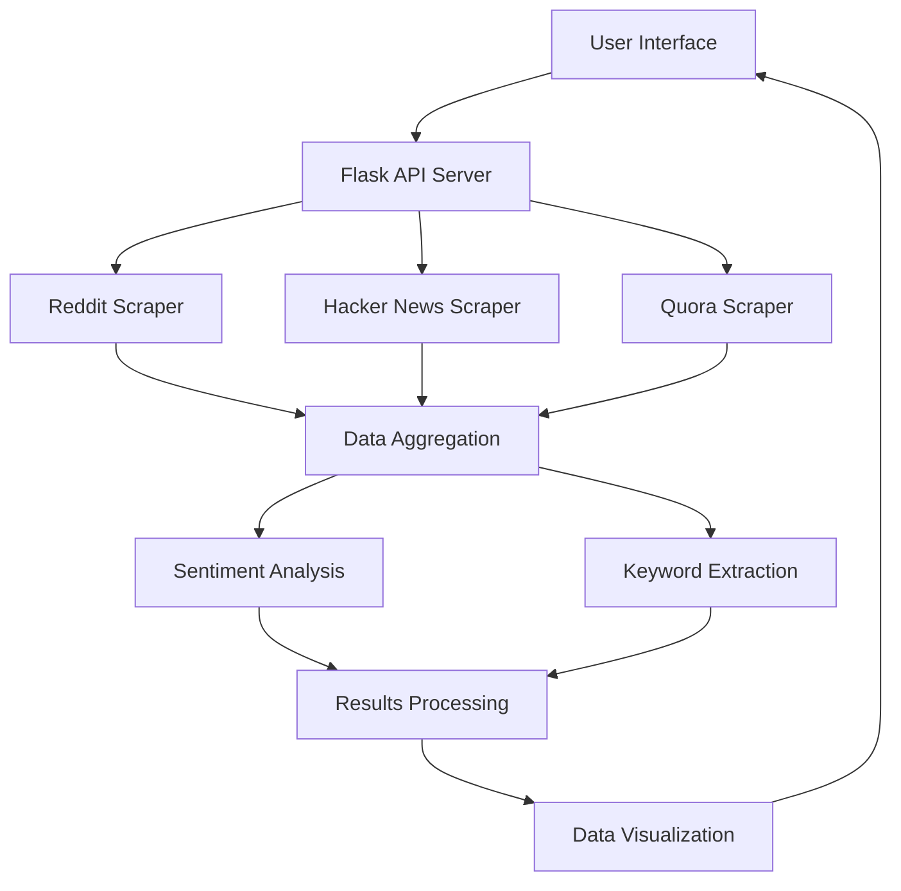
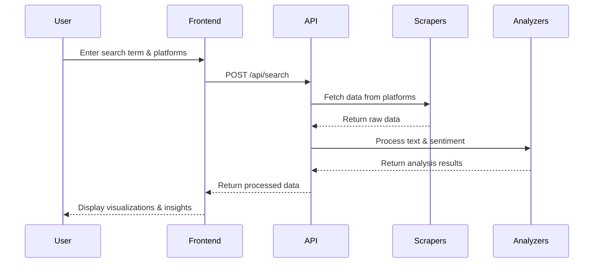

# 🔍 Project Crux: Market Research Bot

<div align="center">
  
  
  
  
  
</div>

> 🧠 A lightweight, real-time market intelligence tool that pulls sentiment and discussion insights from Reddit, Hacker News, and Quora — tailored specifically for developers, indie hackers, and early-stage product teams.

<p align="center">
  
</p>

## ✨ What It Does

- 🔎 **Search & Discover** - Let users search for a product or topic across multiple platforms
- 📊 **Aggregate & Analyze** - Collect forum discussions and perform sentiment analysis
- 📈 **Visualize & Summarize** - Display consumer sentiment with intuitive visualizations
- 💡 **Generate Insights** - Provide AI-generated summaries of trends and discussions

## 🌟 Why It's Unique

- 👨‍💻 **Developer-Focused** - Built for product builders, not marketing teams
- 🔄 **Multi-Platform** - Combines data from Reddit, Hacker News, and Quora
- 📱 **Modular UI** - Real-time sentiment bar, summary, and graphs in a clean interface
- 🌉 **Fills the Gap** - Between enterprise tools and basic Reddit searchers

## 🛠️ Tech Stack

- **🐍 Backend**: Python, Flask
- **🕸️ Web Scraping**: BeautifulSoup, PRAW (Reddit API)
- **🧠 NLP**: spaCy, NLTK
- **😊 Sentiment Analysis**: VADER
- **🖥️ Frontend**: HTML, CSS, JavaScript

## 🚀 Getting Started

### Prerequisites

- Python 3.8 or higher
- Internet connection for API access

### 1️⃣ Installation

Download the project files to your local machine or clone the repository:

```bash
git clone https://github.com/Robo-shep/Brocode.git
cd Brocode
```

### 2️⃣ Environment Setup

```bash
# Create and activate virtual environment
python -m venv venv
venv\Scripts\activate  # On Windows
# On macOS/Linux: source venv/bin/activate

# Install dependencies
pip install -r requirements.txt
```

### 3️⃣ API Configuration

Edit the following files to add your API credentials:

- `src/scrapers/reddit_scraper.py`: Add your Reddit API credentials

```python
REDDIT_CLIENT_ID = "your_client_id"
REDDIT_CLIENT_SECRET = "your_client_secret"
REDDIT_USER_AGENT = "your_user_agent"
```

> 🔑 **Note**: You can obtain Reddit API credentials by creating an app at [Reddit's App Preferences](https://www.reddit.com/prefs/apps)

### 4️⃣ Launch the Backend

```bash
python app.py
```

This will start the Flask server on http://localhost:5000.

### 5️⃣ Test the Application

```bash
python simple_test.py
```

This will:
- ▶️ Start the Flask server in a new command window
- 🧪 Run a test on the API endpoint
- 🌐 Open a simple HTML frontend in your browser for testing

## 📊 Using the Application

1. 🔍 Enter a search term (e.g., "Python", "AI", "Web Development")
2. ✅ Select platforms to search (Reddit, Hacker News, Quora)
3. 🔘 Click "Search" to retrieve and analyze data
4. 📈 View sentiment analysis, top keywords, and sample results

## 🏗️ Architecture



### Data Flow



### Component Structure

```
┌─────────────────────────────────────────────────────┐
│                                                     │
│                    User Interface                   │
│                                                     │
└───────────────────────┬─────────────────────────────┘
                        │
                        ▼
┌─────────────────────────────────────────────────────┐
│                                                     │
│                    Flask API Server                 │
│                                                     │
└──┬─────────────────────┬────────────────────────┬───┘
   │                     │                        │
   ▼                     ▼                        ▼
┌─────────┐       ┌─────────────┐          ┌──────────┐
│ Scrapers │       │  Analyzers  │          │ Visualizer│
└──┬───┬───┘       └──────┬──────┘          └─────┬────┘
   │   │                  │                       │
   │   │                  ▼                       │
   │   │          ┌─────────────┐                 │
   │   │          │  Sentiment  │                 │
   │   │          │  Analysis   │                 │
   │   │          └──────┬──────┘                 │
   │   │                 │                        │
   │   │                 ▼                        │
   │   │          ┌─────────────┐                 │
   │   │          │   Keyword   │                 │
   │   │          │  Extraction │                 │
   │   │          └─────────────┘                 │
   │   │                                          │
   ▼   ▼                                          ▼
┌─────────────────────────────────────────────────────┐
│                                                     │
│                     Data Storage                    │
│                                                     │
└─────────────────────────────────────────────────────┘
```

## 🎨 UI Design

The Market Research Bot features a modern Bento UI design that provides:

- **Card-Based Layout**: Clean, organized information display using a grid system
- **Data Visualization**: Interactive sentiment bars and keyword clouds
- **Platform-Specific Insights**: Dedicated sections for each platform's analysis
- **Responsive Design**: Adapts to different screen sizes for optimal viewing
- **Visual Hierarchy**: Clear organization of information with intuitive navigation

<div align="center">
  
</div>

### UI Components

| Component | Description |
|-----------|-------------|
| Search Panel | Allows users to input search terms and select platforms |
| Sentiment Dashboard | Displays overall sentiment analysis with color-coded indicators |
| Platform Breakdown | Shows sentiment distribution across different platforms |
| Keyword Cloud | Visual representation of trending topics sized by frequency |
| Results List | Displays sample discussions with sentiment indicators |
| Insights Panel | AI-generated summary of key findings and trends |

## 📦 Project Structure

```
market-research-bot/
│
├── 📁 src/
│   ├── 📁 scrapers/
│   │   ├── 📄 reddit_scraper.py
│   │   ├── 📄 hackernews_scraper.py
│   │   └── 📄 quora_scraper.py
│   │
│   ├── 📁 analyzers/
│   │   ├── 📄 sentiment_analyzer.py
│   │   └── 📄 keyword_extractor.py
│   │
│   └── 📄 visualizer.py
│
├── 📄 app.py              # Flask API server
├── 📄 main.py             # Command-line interface
├── 📄 test_api.py         # API endpoint tests
├── 📄 simple_test.py      # Combined backend/frontend test
├── 📄 test_frontend.html  # Simple HTML frontend for testing
├── 📄 requirements.txt
└── 📄 README.md
```

## 🎯 Use Cases

Perfect for:

- 💻 **Hackathon Teams** - Quickly validate ideas and understand market needs
- 🚀 **Indie Hackers** - Research product-market fit before building
- 🏢 **Startup Founders** - Track sentiment about your product or competitors
- 🧑‍💻 **Solo Developers** - Understand user pain points without endless forum reading

## 📝 Future Improvements

- 🐦 Add more data sources (Twitter, Product Hunt, etc.)
- 🧠 Implement more advanced sentiment analysis models
- 📊 Create a sophisticated frontend with interactive data visualizations
- 🔐 Add user authentication and saved searches
- ⚡ Implement caching to improve performance

## 📜 License

This project is licensed under the MIT License - see the LICENSE file for details.

## 👥 Contributors

- [Your Team Names Here]

---

<div align="center">
  <p>Made with ❤️ for the Hackathon</p>
  <p>© 2025 Project Crux - Market Research Bot</p>
</div>
